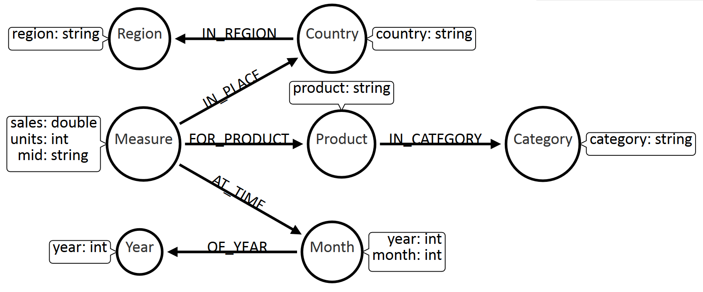
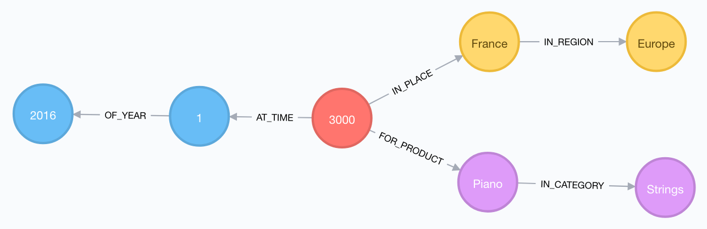
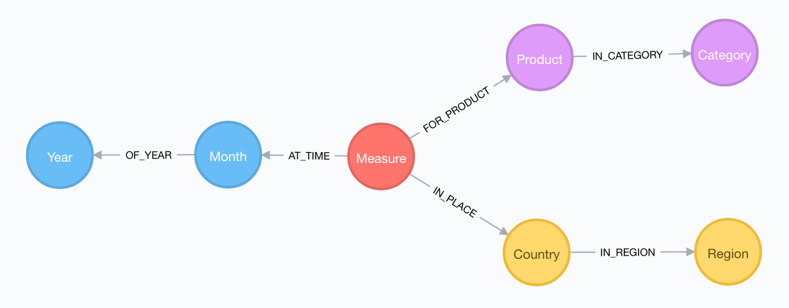
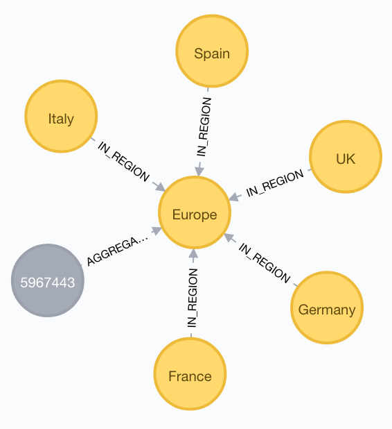
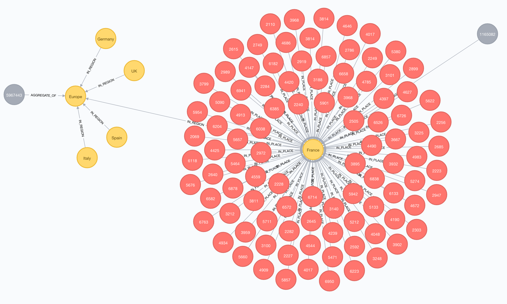
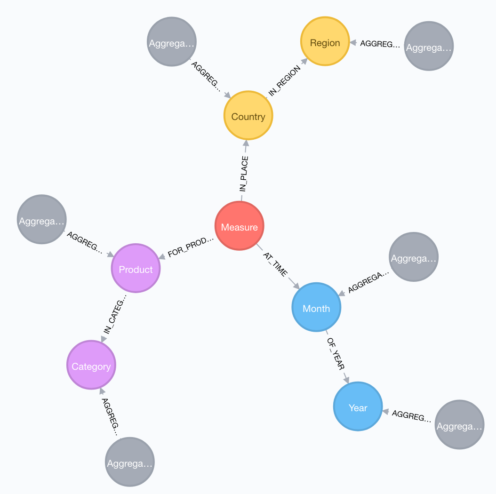
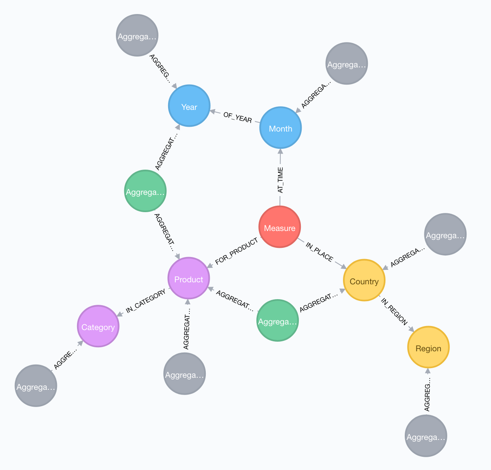

# Graph OLAP with Neo4j

*Alternative title: "The [Graph Kimball](https://en.wikipedia.org/wiki/Ralph_Kimball) Project" (sorry, I could not resist).*

An attempt to model an [OLAP cube](https://en.wikipedia.org/wiki/OLAP_cube) with [Neo4j](https://neo4j.com).

As a former [OLAP developer](https://bimatters1403.wordpress.com/), and [recent adopter](https://github.com/michelcaradec/Graph-Theory) of graph databases, I was curious to check how **Neo4j** could handle **Online Analytical Processing** structures, dedicated to reporting.

These concepts will be experimented by creating an OLAP cube, with the only use of [Cypher](https://neo4j.com/developer/cypher-query-language/) language.

Made with:

- [Visual Studio Code](https://code.visualstudio.com/).
    - [Markdown All in One](https://marketplace.visualstudio.com/items?itemName=yzhang.markdown-all-in-one).
- [draw.io](https://www.draw.io).
- [Arrow Tool](http://www.apcjones.com/arrows/).
- [Neo4j Desktop](https://neo4j.com/download/) with [Neo4j Engine v3.3.3](https://github.com/neo4j/neo4j/releases/tag/3.3.3).

Table of Content:

<details>

- [Neo4j Graph Cube](#neo4j-graph-cube)
    - [Dataset](#dataset)
    - [Cube Structure](#cube-structure)
    - [Storage Implementation](#storage-implementation)
        - [Facts Consolidation](#facts-consolidation)
    - [Data Import](#data-import)
        - [Dimension Import](#dimension-import)
        - [Facts Import](#facts-import)
        - [Implementation Details](#implementation-details)
    - [Querying](#querying)
        - [Query 1 - Sum of Sales for Strings in 2016](#query-1---sum-of-sales-for-strings-in-2016)
        - [Query 2 - Sum of Sales for Strings in January 2016](#query-2---sum-of-sales-for-strings-in-january-2016)
        - [Query 3 - Detail of Sales for Strings in January 2016](#query-3---detail-of-sales-for-strings-in-january-2016)
    - [Aggregates Store](#aggregates-store)
        - [Aggregate Strategy](#aggregate-strategy)
        - [Aggregate Bitmask](#aggregate-bitmask)
        - [Aggregate Creation](#aggregate-creation)
            - [By Place.Region](#by-placeregion)
            - [By Place.Country](#by-placecountry)
            - [By Product.Product x Place.Country](#by-productproduct-x-placecountry)
    - [Querying Aggregates](#querying-aggregates)
        - [Query 1 - Sum of Sales for Violin in France](#query-1---sum-of-sales-for-violin-in-france)
        - [Query 2 - Sum of Sales for Violin in 2016](#query-2---sum-of-sales-for-violin-in-2016)
    - [Conclusion](#conclusion)

</details>

## Dataset

We will use a sample dataset stored in tabulation-delimited files named [sales.2016.tsv](data/sales.2016.tsv) and [sales.2017.tsv](data/sales.2017.tsv).

Top and bottom lines:

```raw
Region         Country    Year  Month  Product   Category  Sales    Units
North America  USA        2016  1      Piano     Strings   4251.00  693
North America  USA        2016  1      Violin    Strings   2789.00  571
North America  USA        2016  1      Cello     Strings   3908.00  311
North America  USA        2016  1      Guitar    Strings   5034.00  284
...
South America  Argentina  2017  12     Clarinet  Winds     4576.00  329
South America  Argentina  2017  12     Trumpet   Brass     3540.00  327
South America  Argentina  2017  12     Trombone  Brass     3646.00  599
South America  Argentina  2017  12     Tuba      Brass     6971.00  465
South America  Argentina  2017  12     Sax       Winds     5718.00  236
```

In order to make it easy to understand, some explanations will be based on a tiny dataset ([sales.small.tsv](data/sales.small.tsv)):

```raw
Region  Country  Year  Month  Product  Category  Sales  Units
France  Europe   2016  1      Piano    Strings   1000   3
France  Europe   2016  1      Piano    Strings   2000   5
France  Europe   2016  1      Violin   Strings   100    1
France  Europe   2016  1      Violin   Strings   200    2
```

## Cube Structure

Our cube will be made of **three dimensions** and **two measures**.

| Object | Type | Components | Description |
|---|---|---|---|
| Product | Dimension | Levels = Category, Product | Products sold. |
| Place | Dimension | Levels = Region, Country | Locations where products were sold. |
| Time | Dimension | Levels = Year, Month | Dates when events (sales) occurred. |
| Measure | Measure | Measures = Sales, Units | Sales in Euros, units sold. |

The [Star Schema](https://en.wikipedia.org/wiki/Star_schema) model of our cube:


## Storage Implementation

Each component (levels and measures) will be stored as nodes.

Nodes will be linked by relationships to represent how they are hierarchically connected.

| Dimension | Level | Label |
|---|---|---|
| Product | Category | `:Category` |
| Product | Product | `:Product` |
| Place | Region | `:Region` |
| Place | Country | `:Country` |
| Time | Year | `:Year` |
| Time | Month | `:Month` |
| Measures | | `:Measure`|

This gives use the following meta-model:



Example:



*Graph generated importing the first 3 lines (including header) of the tiny dataset.* 

- For dimensions, there will be one node per member of each level.
- For facts, there will be one node per event for a given product, place and time (i.e. [leaf level members](http://olap.com/learn-bi-olap/olap-bi-definitions/leaf-level/) of corresponding dimensions).

In the following screenshot, **Product** category **Strings** appears once, and is connected to two products (**Piano** and **Violin**). The same principle is applied for **Time** and **Place** dimensions.


*Graph generated importing the tiny dataset.* 

There are two facts nodes, corresponding to two events which occurred in **France** in **January 2016** for **Piano** and **Violin**.

### Facts Consolidation

Multiple events can occur at the same time, for the same product and the same country (see rows 2-3 and 4-5 of our tiny dataset).

At import time, facts must be aggregated to a single `:Measure` node containing cumulated values (using Sum aggregation operator).

## Data Import

We will use the [LOAD CSV](http://neo4j.com/docs/developer-manual/current/cypher/clauses/load-csv/) clause to import our data.

Before starting, let's initialize our database with some index creation:

```cypher
// Dimensions
CREATE INDEX ON :Country(country);
CREATE INDEX ON :Product(product);
CREATE INDEX ON :Month(month);
// Measures
CREATE INDEX ON :Measure(mid);
```

Our import script must support:

- **Incremental** data import, as data can come from multiple data sources, at different time, with overlapping events.
- **[Slowly changing dimension](https://en.wikipedia.org/wiki/Slowly_changing_dimension)**: we will keep it simple by overwriting property values.

First part of the import script:

```cypher
UNWIND ["sales.2016.tsv", "sales.2017.tsv"] AS sourceFile
//USING PERIODIC COMMIT 500
LOAD CSV WITH HEADERS
    FROM "file:///sourceFile" + sourceFile
    AS row
    FIELDTERMINATOR '\t'
```

Second line was commented as it doesn't seem possible to mix [UNWIND](https://neo4j.com/docs/developer-manual/current/cypher/clauses/unwind/) or [FOREACH](https://neo4j.com/docs/developer-manual/current/cypher/clauses/foreach/) clauses with [USING PERIODIC COMMIT](https://neo4j.com/docs/developer-manual/current/cypher/query-tuning/using/#query-using-periodic-commit-hint) query hint.

### Dimension Import

For each dimensions levels, we will create one node per member. Nodes hierarchically related will be connected by a relationship.

Example for **Europe** and **France** (respectively members of **Region** and **Country** levels of **Place** dimension): `(:Country {country: 'France'})-[:IN_REGION]->(:Region {region: 'Europe'})`.

Place dimension:

```cypher
MERGE (r:Region {region: row.Region})
MERGE (c:Country {country: row.Country})
MERGE (c)-[:IN_REGION]->(r)
```

Product dimension:

```cypher
MERGE (cat:Category {category: row.Category})
MERGE (prod:Product {product: row.Product})
MERGE (prod)-[:IN_CATEGORY]->(cat)
```

Time dimension:

```cypher
MERGE (y:Year {year: toInteger(row.Year)})
MERGE (m:Month {year: toInteger(row.Year), month: toInteger(row.Month)})
MERGE (m)-[:OF_YEAR]->(y)
```

For **Month** level (`:Month` node), a `year` property is added in order to disambiguate months from different years (**March 2016** is different from **March 2017**).

### Facts Import

Import script continues with the import of measures:

```cypher
WITH
    c, m, prod, row,
    c.country + '_' + toString(m.year) + '_' + toString(m.month) + '_' + prod.product AS MeasureID
// Facts
MERGE (meas:Measure {mid: MeasureID})
ON CREATE
    // Create new fact node
    SET meas.sales = toFloat(row.Sales),
    meas.units = toInteger(row.Units)
ON MATCH
    // Update fact node
    SET meas.sales = meas.sales + toFloat(row.Sales),
    meas.units = meas.units + toInteger(row.Units)
// Foreign keys
MERGE (meas)-[:IN_PLACE]->(c)
MERGE (meas)-[:AT_TIME]->(m)
MERGE (meas)-[:FOR_PRODUCT]->(prod)
```

The full import cypher script can be found in [create.v2.cypher](cypher/create.v2.cypher) file.

Output after execution:

```raw
Added 4285 labels, created 4285 nodes, set 12757 properties, created 12723 relationships, completed after 4277 ms.
```

### Implementation Details

Slowly changing dimension is handled by using [MERGE](https://neo4j.com/docs/developer-manual/current/cypher/clauses/merge/) expressions. It succeeds in updating or inserting level members.

An extra challenge must be faced with measures, as properties can't just be overwritten. If a node already exists for a given event, imported values must be added to existing ones.

A [first version of the script](cypher/create.v1.cypher) was relying on [OPTIONAL MATCH](https://neo4j.com/docs/developer-manual/current/cypher/clauses/optional-match/) clause to identify existing and non-existing measure nodes, based on presence of as many relationships as number of dimensions for the event to import:

```cypher
WITH c, m, prod, row
// Facts
OPTIONAL MATCH
    (meas:Measure)-[:IN_PLACE]->(c),
    (meas:Measure)-[:AT_TIME]->(m),
    (meas:Measure)-[:FOR_PRODUCT]->(prod)
// Create new fact node
FOREACH (x IN CASE WHEN meas IS NULL THEN [1] ELSE [] END |
    CREATE (meas:Measure {sales: toFloat(row.Sales), units: toInteger(row.Units)})
    // Foreign keys
    CREATE (meas)-[:IN_PLACE]->(c)
    CREATE (meas)-[:AT_TIME]->(m)
    CREATE (meas)-[:FOR_PRODUCT]->(prod)
)
// Update fact node
FOREACH (x IN CASE WHEN meas IS NULL THEN [] ELSE [1] END |
    SET meas.sales = meas.sales + toFloat(row.Sales)
    SET meas.units = meas.units + toInteger(row.Units)
)
```

For some reason I couldn't explain, existing measures were never detected, leading to systematic measure node creation (i.e. last part of the script was never executed).

This option was initially preferred for its **relationship-oriented nature**. As I wasn't successful in making it work, an [alternative solution was found, as previously seen](#facts-import), based on an extra-property named `mid` (for **M**easure **ID**entifier) containing duplicate information on its related dimension members.

The full non-working import cypher script can be found in [create.v1.cypher](cypher/create.v1.cypher) file.

The execution of the data import script gives the following meta-model:



## Querying

A this stage, we have an OLAP-like graph structure containing consolidated facts.

We are now ready to run few queries.

### Query 1 - Sum of Sales for Strings in 2016

```cypher
MATCH (cat:Category {category: 'Strings'})<-[*]-(meas:Measure)
MATCH (year:Year {year: 2016})<-[*]-(meas:Measure)
RETURN
    SUM(meas.sales) AS Sales,
    SUM(meas.units) AS Units;
```

Output (from tiny dataset):

| Sales | Units |
|---|---|
| 3300 | 11 |

### Query 2 - Sum of Sales for Strings in January 2016

```cypher
MATCH (cat:Category {category: 'Strings'})<-[*]-(meas:Measure)
MATCH (year:Year {year: 2016})<-[]-(month:Month {month: 1})<-[]-(meas:Measure)
RETURN
    SUM(meas.sales) AS Sales,
    SUM(meas.units) AS Units;
```

Alternatively:

```cypher
MATCH (cat:Category {category: 'Strings'})<-[*]-(meas:Measure)
MATCH (month:Month {year: 2016, month: 1})<-[]-(meas:Measure)
RETURN
    SUM(meas.sales) AS Sales,
    SUM(meas.units) AS Units;
```

Output (from tiny dataset):

| Sales | Units |
|---|---|
| 3300 | 11 |

### Query 3 - Detail of Sales for Strings in January 2016

Returning the detail of an aggregated measure is called [Drill-through](http://olap.com/learn-bi-olap/olap-bi-definitions/drill-through/).

```cypher
MATCH (cat:Category {category: 'Strings'})<-[]-(prod:Product)<-[]-(meas:Measure)
MATCH (year:Year {year: 2016})<-[]-(month:Month {month: 1})<-[]-(meas:Measure)
RETURN
    year.year AS Year,
    month.month AS Month,
    cat.category AS Category,
    prod.product AS Product,
    meas.sales AS Sales,
    meas.units AS Units
LIMIT 10;
```

Output (from tiny dataset):

| Year | Month | Category | Product | Sales | Units |
|---|---|---|---|---|---|
| 2016 | 1 | Strings | Piano | 3000 | 8 |
| 2016 | 1 | Strings | Violin | 300 | 3 |

## Aggregates Store

The [queries](#Querying) we previously wrote only relied on facts to return a result. Once retreived, facts must be aggregated with the use of [SUM](https://neo4j.com/docs/developer-manual/current/cypher/functions/aggregating/#functions-sum) aggregation function.

This does the job, but is far from OLAP philosophy, where aggregates can be pre-calculated in order to improve query response time.

### Aggregate Strategy

Aggregates will be stored as nodes, with a label name composed of two parts:

- A prefix `:Aggregate_`.
- A suffix representing an [aggregate bitmask](#aggregate%20bitmask).

Example: `(:Aggregate_000000)`.

This concept is called [MOLAP](https://en.wikipedia.org/wiki/Online_analytical_processing#Multidimensional_OLAP_.28MOLAP.29) when applied to a multi-dimensional database store, [ROLAP](https://en.wikipedia.org/wiki/Online_analytical_processing#Relational_(ROLAP)) when applied to a relational one. Let's call it **GOLAP** (for Graph OLAP), as we are using a graph database store (we could also call it **NOLAP** for Neo4j OLAP).

### Aggregate Bitmask

An aggregate bitmask is a sequence of characters that **identifies** which part of a [sub-cube](https://en.wikipedia.org/wiki/OLAP_cube#Operations) an aggregate is calculated on.

The sequence is composed of N positions (one for each level), each position taking one of the following values:

| Value | Description |
|---|---|
| x | Aggregate is calculated for all members of the level. |
| 0 | No aggregate is calculated for the level. |
| 1 | Aggregate is calculated for each member of the level. |

The order of the position is very important, and must remain the same. If the cube structure is modified (by the addition of extra dimensions or levels), aggregate strategy must be redefined.

Aggregate sequence will be composed of **six positions** for our sample cube, as it contains six levels (**Category**, **Product**, **Region**, **Country**, **Year**, **Month**).

Aggregate bitmask construction:

| Product.Category | Product.Product | Place.Region | Place.Country | Time.Year | Time.Month | Description | Scope |
|---|---|---|---|---|---|---|---|
| 1 | 0 | x | 0 | x | 0 | By Product.Category | One-level |
| 0 | 1 | x | 0 | x | 0 | By Product.Product | One-level |
| 0 | 1 | 0 | 1 | x | 0 | By Product.Product x Place.Country | Two-levels |

### Aggregate Creation

There are six **one-level** aggregates for our sample cube:

| Aggregate | Description |
|---|---|
| Aggregate_10x0x0 | By Product.Category |
| Aggregate_01x0x0 | By Product.Product |
| Aggregate_x010x0 | By Place.Region |
| Aggregate_x001x0 | By Place.Country |
| Aggregate_x0x010 | By Time.Year |
| Aggregate_x0x001 | By Time.Month |

#### By Place.Region

```cypher
MATCH (r:Region)<-[*2]-(meas:Measure)
WITH DISTINCT r, SUM(meas.sales) AS SumSales, SUM(meas.units) As SumUnits
CREATE (a:Aggregate_x010x0 {sales: SumSales, units: SumUnits})-[:AGGREGATE_OF]->(r);
```

Output:

```
Added 5 labels, created 5 nodes, set 10 properties, created 5 relationships, completed after 36 ms.
```

Here is how **Aggregate_x010x0** aggregate fits in the graph for **Europe** region:



*Aggregate node is coloured in grey.*

#### By Place.Country

```cypher
MATCH (ct:Country)<-[]-(meas:Measure)
WITH DISTINCT ct, SUM(meas.sales) AS SumSales, SUM(meas.units) As SumUnits
CREATE (a:Aggregate_x001x0 {sales: SumSales, units: SumUnits})-[:AGGREGATE_OF]->(ct);
```

Output:

```
Added 16 labels, created 16 nodes, set 32 properties, created 16 relationships, completed after 28 ms.
```

Here is how **Aggregate_x010x0** (by Place.Region) and **Aggregate_x001x0** (by Place.Country) aggregates fit in the graph for **Europe** and **France**:



The higher the level, the greater the performance benefit when querying aggregate nodes (coloured in grey), as they prevent querying indivudual (i.e. detail) measure nodes (coloured in red).

The creation of the one-level aggregates gives the following meta-model:



*One-level aggregate nodes are coloured in grey.*

#### By Product.Product x Place.Country

This is a **two-levels** aggregate, as it is calculated by the combination of two levels.

```cypher
MATCH (prod:Product)<-[]-(meas:Measure)
MATCH (ct:Country)<-[]-(meas:Measure)
WITH DISTINCT prod, ct, SUM(meas.sales) AS SumSales, SUM(meas.units) As SumUnits
CREATE (prod)<-[:AGGREGATE_OF]-(a:Aggregate_0101x0 {sales: SumSales, units: SumUnits})-[:AGGREGATE_OF]->(ct);
```

Other aggregate creation commands can be found in file [aggregates.cypher](cypher/aggregates.cypher).

The creation of the two-levels aggregates gives the following meta-model:



*One-level aggregate nodes are coloured in grey, two-levels ones in green.*

All commands are consolidated in one single file [full_script.cypher](cypher/full_script.cypher).

## Querying Aggregates

[Aggregates](#aggregate-bitmask) can now be used in queries.

### Query 1 - Sum of Sales for Violin in France

```cypher
MATCH (prod:Product {product: 'Violin'})<-[]-(a:Aggregate_0101x0)-[]->(ct:Country {country: 'France'})
RETURN
    a.sales AS Sales,
    a.units AS Units;
```

### Query 2 - Sum of Sales for Violin in 2016

```cypher
MATCH (prod:Product {product: 'Violin'})<-[]-(a:Aggregate_01x010)-[]->(ct:Year {year: 2016})
RETURN
    a.sales AS Sales,
    a.units AS Units;
```

It doesn't necessarily make sens to create all possible aggregates.

Aggregate creation is based on a good understanding of business needs (i.e. how data is queried). Some OLAP engines such as [Microsoft SQL Server Analysis Services](https://www.microsoft.com/en-us/sql-server/business-intelligence) propose some tooling to help selecting good aggregate candidates based on previously executed queries. We could imagine implementing such a feature based on [Neo4j query log](https://neo4j.com/docs/operations-manual/current/monitoring/logging/query-logging/), but this is out of the scope of this workshop.

## Conclusion

There are many other features that could be explored, such as:

- [Schema discovery](https://docs.microsoft.com/en-us/sql/analysis-services/schema-rowsets/analysis-services-schema-rowsets).
- [Custom-rollup](https://docs.microsoft.com/en-us/sql/analysis-services/multidimensional-models/parent-child-dimension-attributes-custom-rollup-operators).
- [Writeback](https://docs.microsoft.com/en-us/sql/analysis-services/multidimensional-models/set-partition-writeback).
- Benchmark.

This workshop was an opportunity to challenge (and learn) Neo4j and Cypher in an area it wasn't primarily designed for (even if we are dealing with lots of relationships).

Each data engine is designed to address specific purposes, so we can't expect one being as feature-complete as another one for such different fields as OLAP and Graphs.
